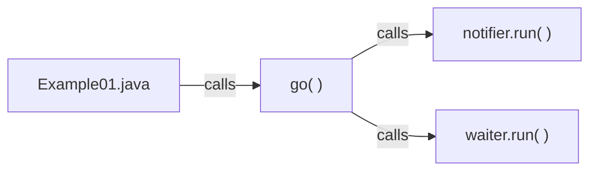

$\mathtt{NOTE}$
- ciascuna parte di codice di rilevanza, verrà qui discussa nel dettaglio;
- la discussione sul codice è presa dalle lezioni in presenza/registrazioni, potete verificarne così la veridicità;
- usiamo JAVA8 come versione; quando viene cercato su internet un metodo o una classe, fare attenzione che la documentazione si riferisca alla versione giusta.
---
```toc
```

# Costruzione dei thread

> [!note] Nomenclatura in JAVA
> Seguiamo la denominazione standard:
> - i metodi vengono sempre scritti con l'iniziale <u>m</u>inuscola;
> 	  `run()`
> - le classi vengono sempre scritte con l'iniziale <u>M</u>aiuscola;
> 	  `Notifier`
> - per separare le parole composte NON usiamo '\_' ma mettiamo la <u>M</u>aiuscola ad ogni nuova parola;
> 	  `waitInProgress`

Abbiamo visto la costruzione dei thread in JAVA (estendendo `Thread` o implementando `Runnable`) e abbiamo visto come costruire un progetto in Eclipse. Abbiamo visto come aggiungere una classe in un package, quindi usiamo quello appena imparato per crearne due:
- un thread *Waiter* rimane in attesa aspettando la notifica di un altro;
- un thread *Notifier* dopo un'attesa di tot secondi randomica, notifica con `notifyAll()`.

Usando Eclipse clicchiamo col tasto destro sul nostro package `it.unipr.informatica.example01` e creiamo una nuova classe con `New > Class` chiamandola *Notifier*.

![[Pasted image 20221111070054.png|500]]

## `Notifier`
Al suo interno estendiamo la classe `Thread`, siccome uno dei due modi per creare thread è o questo, o implementare l'interfaccia Runnable. Siccome il metodo `run()` (seppure vuoto) esiste già all'interno di `Thread`, facciamo `@Override` per scriverne un'implementazione.

> [!note] Nota su `@Override`
> Buona norma detta che il nostro metodo debba sempre essere preceduto da `@Override`, perché ci aiuta a non fare errori nell'implementazione: se omettessimo la parola chiave, non verrebbe segnalato nulla, il codice funzionerebbe lo stesso ma la creazione del metodo non sarebbe più una della classe che stiamo estendendo `Thread`

```java
package it.unipr.informatica.example01;

public class Notifier extends Thread {
	@Override
	public void run() {
	}
}
```

### `InterruptedException` vs `Throwable`
Proviamo a mettere all'interno del nostro metodo, un metodo statico di `Thread` per l'attesa di qualche secondo: `sleep(millis)`. Facendo ciò, decidiamo che 5sec possono essere sufficienti. Gestiamo anche l'eccezione che lancerebbe `sleep` con un `try-catch`.
L'eccezione da catturare possiamo deciderla noi:
di base, `sleep` lancia `InterruptedException` (siccome estende `Interrupted`), ma nel caso in cui non ci fidassimo o volessimo verificare la presenza di altre eccezioni, catturiamo `Throwable` per catturarle tutte.

> [!note] Estendiamo di default `InterruptedException`
```java
try {
	Thread.sleep(5000);
} catch(InterruptedException e) {
	//TODO
}
```

> [!note] Catturiamo tutto `Throwable`
```java
try {
	Thread.sleep(5000);
} catch(Throwable throwable) {
	//TODO
}
```

Quindi, per intenderci, dobbiamo catturare l'eccezione perché quando siamo in stato d'attesa qualcuno dall'esterno, può bloccare il Thread che lancerà, per ciascuno, `InterruptedException`. Ogni Thread verrà interrotto.

### `Notifier.java`
> [!note] Esempio di classe `Notifier.java` che usa `Throwable`
```java
package it.unipr.informatica.example01;

public class Notifier extends Thread {
	@Override
	public void run() {
		System.out.println("Started");
		
		try {
			// best-effort, almeno 5sec vengono garantiti
			Thread.sleep(5000);
		} catch(Throwable throwable) {
			// blank
		}
		
		System.out.println("Terminated")
	}
}
```

### `Example01.java`
Torniamo ora nella classe con il `main`, dove ragioneremo su come lanciare il thread `Notifier`. Il `main`, essendo metodo `static` non ha accesso agli attributi che non sono uguali di tipo; definiamo la `go()` come tipo `public`.

Per usare la `Notifier`, creiamo un oggetto di tipo `Thread`; prendiamo l'abitudine di creare nuovi oggetti, siccome poi ci potrebbe servire usare i loro stati.
Il nuovo oggetto avrà compito di fare `start()` per avviare l'attesa.

> [!note] Esempio di classe `Example01.java`
```java
public class Example01 {
	public void go() {
		Thread notifier = new Notifier();
		
		notifier.start();
	}
	
	public static void main(String[] args) {
		new Example01().go();
	}
}
```

La compilazione ed esecuzione del programma porterà al seguente risultato aspettato.
![[Pasted image 20221111114538.png]]

### `Notifier` + `Example01`
Se il `Waiter` deve fare `wait()` su un oggetto, e il `Notifier` deve fare `notifyAll()` su un oggetto, quello sarà lo stesso oggetto, che è `Example01`.

`Notifier` non vede tuttavia l'oggetto `Example01`.
Ragionevolmente lo scopo di `Notifier` è solo quello di costruire un thread e fare `notifyAll()`, mentre quello del `Waiter` e' fare `wait()`.

**Un nuovo file separato dall'oggetto `Example01` non ha molto senso, siccome entrambi `Notifier` e `Waiter` devono vedersi gli stati a vicenda.**

Spostiamo quindi il codice della `Notifier` dentro a `Example01`, cancellando il vecchio file e mentre lo facciamo, *anonimizziamo* la classe siccome dargli un nome non e' necessario, siccome la usiamo una volta soltanto.

>[!note] Estendere `Thread` o implementare `Runnable`?
>Sono la stessa cosa.
>L'importante e' non creare un file separato per la classe `Notifier`, siccome poi non potrebbe vedere gli stati di `Example01`.
>
>```java
>Thread notifier = new Thread () {
>}
>```
>E' equivalente a scrivere:
>
>```java
>Runnable runnable = new Runnable() {
>}
>```

> [!note] `Example01.java` contiene ora la `Notifier`
```java
package it.unipr.informatica.example01;

public class Example01 {
	public void go() {
		// usiamo Runnable
		Runnable runnable = new Runnable() {
			@Override
			public void run() {
				System.out.println("Started");
				try {
					// best-effort, almeno 5sec vengono garantiti
					Thread.sleep(5000);
				} catch(Throwable throwable) {
				    // blank
				}
				System.out.println("Terminated")
			}
		};
		// usiamo come argomento del costruttore il Runnable
		Thread notifier = new Thread(runnable);
		notifier.start();
	}
	
	public static void main(String[] args) {
		new Example01().go();
	}
}
```

## `Waiter`
Si dovrà mettere in attesa e aspettare che il `Notifier` lo notifichi.
Per crearlo, ci basta prima ridefinire l'implementazione di `Runnable`.

```java
// ridefiniamo Runnable
runnable = new Runnable() {
	@Override
		public void run() {
			System.out.println("Waiter started");
			
			System.out.println("Waiter terminated");
		}
	};

// creiamo il waiter
Thread waiter = new Thread(runnable);
```

### `mutex` e regione critica
L'oggetto su cui facciamo operazioni e' uno di tipo `Object`, privato ad `Example01`, e lo scriviamo in cima, prima della `go()`. Chiamiamo per semplicita' questo oggetto: `mutex`.

```java
private Object mutex = new Object();
```

> [!warning] Attenzione alla sincronizzazione sul `mutex`
> L'oggetto su cui vogliamo lavorare, `mutex`, si deve trovare in una regione critica o meglio, in un blocco `synchronized`. Questo e' l'unico caso in qui il compilatore ci segnala errore. Da ricordare anche che l'oggetto su cui facciamo la sincronizzazione, deve essere lo stesso argomento del blocco.
> 
> ```java
> synchronized(mutex){
> 	mutex.notifyAll();
> }
> ```
![[Pasted image 20221111162906.png]]

Aggiunta la regione critica per entrambi i thread che opereranno sull'oggetto in comune, e aggiunti i blocchi `try-catch` per catturare l'eccezioni, ecco il risultato.

> [!note] `Waiter` e `Notifier` lavorano assieme sul `mutex`
```java
package it.unipr.informatica.example01;

public class Example01 {
	// Notifier e Waiter possono accedervi
	private Object mutex = new Object();
	
	public void go() {
		// usiamo Runnable
		// Notifier
		Runnable runnable = new Runnable() {
			@Override
			public void run() {
				System.out.println("Notifier started");
				try {
					// best-effort, almeno 5sec vengono garantiti
					// 2
					Thread.sleep(5000);
				} catch(Throwable throwable) {
				    // blank
				}
				// 3
				synchronized(mutex) {
					mutex.notifyAll();
				}
				System.out.println("Notifier terminated")
			}
		};
		// usiamo come argomento del costruttore il Runnable
		Thread notifier = new Thread(runnable);
		
		// Waiter
		runnable = new Runnable() {
			@Override
			public void run() {
				// 5
				System.out.println("Waiter started");
				synchronized(mutex) {
					try {
						// 6
						mutex.wait();
					} catch (Throwable throwable) {
					// blank
					}
				System.out.println("Waiter terminated");
			}
		};
		
		Thread waiter = new Thread(runnable);
		// 1
		notifier.start();
		// 4
		waiter.start();
	}
	
	public static void main(String[] args) {
		new Example01().go();
	}
}
```

Abbiamo tuttavia un problema, non irrilevante, di sincronizzazione.
Seguiamo questo ragionamento per identificarlo (vedi commenti in alto numerati):
1) facciamo `start()` di `Notifier`
2) facciamo `sleep(5000)`
3) facciamo `notifyAll()`
4) facciamo `start()` del `Waiter`
5) facciamo `System.out.println("Waiter started");`
6) facciamo `wait()`

Niente ci garantisce che la `NotifyAll()` venga fatta dopo la `wait()`.
Potrebbe succedere, anche se poco probabile nel caso di 5 secondi di attesa, che i due thread partano ma senza l'ordine da noi voluto.
[[#Soluzione al problema di sincronizzazione]]

## Esemplificazione del codice


Sarebbe utile semplificare il codice.
Cosi' come e' scritto non e' sbagliato ma inizia a essere complicato: proprio a causa delle inner class che stiamo creando a mano a mano che andiamo avanti, nuovi percorsi di esecuzione si stanno aggiungendo alla lista e gestirli nell'insieme diventa difficile.

### Metodi separati
Per risolvere, potremmo creare un metodo che contiene la `run()` di ciascuno.
Questo e' solo *refractoring* del codice, i 2 flussi di esecuzione sono ancora presenti ma leggermente piu' comprensibile diventa il codice.
```java
runnable = new Runnable() {
	@Override
	public void run() {
		doWait();
	}
};

private void doWait() {
	System.out.println("Waiter started");
	synchronized(mutex) {
		try {
			mutex.wait();
		} catch(Throwable throwable) {
			//blank
		}
	}
	System.out.println("Waiter terminated");
}
```

```java
runnable = new Runnable() {
	@Override
	public void run() {
		doNotify();
	}
};

private void doNotify() {
	System.out.println("Notifier started");
	try {
		// best-effort, almeno 5sec vengono garantiti
		Thread.sleep(5000);
	} catch(Throwable throwable) {
	    // blank
	}
	synchronized(mutex) {
		mutex.notifyAll();
	}
	System.out.println("Notifier terminated")
}
```

### Interfacce funzionali ( -> )
Ma quello che invece facciamo e' usare la stessa tecnica, pero' in JAVA8, dove possiamo implementare sia interfaccia che unico metodo in una volta sola.
Il nome e' **interfaccia funzionale**, applicante quella che e' la *lambda expression*.
```java
Thread notifier = new Thread(() -> {
	doNotify();
});
```

```java
Thread waiter = new Thread(() -> {
	doWait();
});
```

Scritto meglio ancora, siccome la lambda-expression e' invocata sull'oggetto `this`:
```java
Thread notifier = new Thread(this::doNotify);
```

```java
Thread waiter = new Thread(this::doWait);
```

## Soluzione al problema di sincronizzazione
Come risolviamo il problema visto in [[#`mutex` e regione critica]]?
Permettiamo alla `notifyAll()` di aspettare che venga eseguita la `wait()`, usando uno stato:

```java
private boolean waitInProgress = false;
```

che impostiamo a `true` appena entriamo nel blocco `synchronized` di `doWait()`

```java
private void doWait() {
	System.out.println("Waiter started");
	synchronized(mutex) {
		waitInProgress = true;
		try {
			mutex.wait();
		} catch(Throwable throwable) {
			//blank
		}
	}
	System.out.println("Waiter terminated");
}
```

# `Example01.java`
```java
package it.unipr.informatica.example;

public class Example01 {
	// creiamo mutex condiviso
	private Object mutex = new Object();
	// creiamo un controllo: siamo in wait o no?
	private boolean waitInProgress = false;
	
	public void go() {
		// ridondante, ma per sicurezza lo mettiamo
		waitInProgress = false;
		Thread notifier = new Thread(this::doNotify);
		Thread waiter = new Thread(this::doWait);
		notifier.start();
		waiter.start();
	}
	
	private void doWait() {
		System.out.println("Waiter started");
		synchronized(mutex) {
			waitInProgress = true;
			mutex.notifyAll();
			try {
				mutex.wait();
			} catch(Throwable throwable) {
				//blank
			}
			waitInProgress = false;
		}
		System.out.println("Waiter terminated");
	}
	
	private void doNotify() {
		System.out.println("Notifier started");
		synchronized(mutex) {
			try {
				// continiuamo a controllare se siamo in wait o no
				while (!waitInProgress)
					mutex.wait();
				// facciamo sleep se lo siamo
				Thread.sleep(5000);
				// notifichiamo infine
				mutex.notifyAll();
			} catch (Throwable trhowable) {
				// blank
			}
		}
		System.out.println("Notifier terminated")
	}
	
	public static void main(String[] args) {
		new Example01().go();
	}
}
```

![[Pasted image 20221111185942.png]]