<center>Table of contents</center>

- [[#Callable & Future]]
- [[#`it.unipr.informatica.concurrent`]]
	- [[#`ExecutionException.java`]]
	- [[#`Future.java`]]
	- [[#`SimpleFuture.java`]]
	- [[#`ExecutorService.java`]]
	- [[#`SimpleThreadPoolExecutorService.java`]]
- [[#Example06]]
	- [[#`ResourceContent.java`]]
	- [[#`DownloadManager.java`]]
	- [[#`Example06.java`]]

# Callable & Future
Quello che abbiamo fatto nell'[[Example05]] e' usare un `ExecutorService` solo tramite interfaccia base `Executor` con `task` di tipo `Runnable`, senza argomenti senza tipo di argomento in ritorno.
Leggevamo i dati dalla rete e passavamo il numero di byte letti.
Se volessimo restituire i dati letti, per vedere la pagina html per esempio, non ci riusciamo.

[Callable in JAVA8 Documentation](https://docs.oracle.com/javase/8/docs/api/java/util/concurrent/Callable.html)

Nella `ExecutorService` troviamo dei metodi che prendono un `Callable<T>`, ovvero un qualcosa che puo' essere chiamato. L'interfaccia `Callable` e' la sostituzione della `Runnable` e in piu' specifica:
- il lancio di eccezioni;
- il <u>tipo di dato del valore di ritorno</u>, ritorno un valore di tipo `<T>` tramite l'unica funzione chiamata `call()`.

Useremo `call()` per eseguire codice tipo di dato `<T>`, che poi in qualche modo dovremo ritornare. A questo scopo usiamo l'interfaccia `Future` per avere un oggetto in mano, continuare a fare calcoli e fare *rendez-vous* dei thread. Per costruire l'interfaccia aggiungiamo al package `concurrent` il file `ExecutionException`.

`Future` viene usato dagli `ExecutorService` per permettere di attivare dei task che ritornino dei risultati.

# `it.unipr.informatica.concurrent`
## `ExecutionException.java`
La cuasa dell'interruzione dell'esecuzione lanciata dal `Future`.
```java
package it.unipr.informatica.concurrent;

public class ExecutionException extends Exception {
	private static final long serialVersionUID = 
		-1644619538323674773L;
	
	public ExecutionException(Throwable cause) {
		super(cause);
	}
}
```

## `Future.java`
Ha come tipo del risultato un generico `<T>`, in grado di lanciare `ExecutionException` checked (siccome nella signature), lanciata se il task produce un'eccezione e se non lo fa, `get()` ritorna.
```java
package it.unipr.informatica.concurrent;

public interface Future<T> {
	public T get() throws InterruptedException, ExecutionException;
	
	public boolean isDone();
	}
}
```

## `SimpleFuture.java`
Package scoped, contiene quattro attributi:

1) `mutex`
	la `get()` serve fare un'attesa, quindi `wait()`, ci serve un oggetto mutex;
2) `done`
	booleano per dire se e' stato prodotto risultato o un'eccezione;
3) `value`
   il risultato di tipo `<T>`;
4) `exception`
	l'eccezione, se per qualche motivo il task la lancia viene memorizzata.

```java
package it.unipr.informatica.concurrent;

// package scope significa che tutti la vedono
class SimpleFuture<T> implements Future {
	private Object mutex;
	private T value;
	private Throwable exception;
	private boolean done;
	SimpleFuture() {
		this.mutex = new Object();
		this.done = false;
		this.value = null;
		this.exception = null;
	}
	//..
```
---
Si limita a ritornare `done`: se e' `false` nessuna eccezione e nessun risultato, se e; `true` allora qualcosa e' successo.
```java
	//...
	@Override
	public boolean isDone() {
		synchronized(mutex) {
			return done;
		}
	}
	//...
```
---
Una sezione critica che ci permette di verificare se c'e' eccezione o value, su `done`. Appena il mutex si sblocca qualcuno ci ha notificato, usciamo direttamente.
```java
	//...
	@Override
	public T get() throws InterruptedException, ExecutionException {
		synchronized(mutex) {
			if(!done)
				mutex.wait();
			if(exception != null)
				throw new ExecutionException(exception);
			return value;
		}
	}
	//...
```
---
Scrive il risultato del task all'interno del `Future`.
Se e' gia' stato prodotto un risultato, non va bene e non puo' essere, quindi lanciamo `IllegalStateException` (c'e' un bug, il task deve terminare).
Se `done` e' a false significa che il riferimento al risultato e' conosciuto e quindi lo impostiamo, svegliamo poi tutti i thread che cercheranno di entrare in sezione critica.
```java
	//...
	void setValue(T object) {
		synchronized (mutex) {
			if(done)
				throw new IllegalStateException("done == true");
			value = object;
			done = true;
			mutex.notifyAll();
		}
	}
	//...
```
---
Il `Throwable` non puo' essere nullo, se `done` e' true non va bene.
Se nessuno dei due problemi si presenta, memorizziamo il riferimento all'eccezione, notifichiamo e quindi svegliamo i thread che lanceranno eccezione con dentro il `throwable` origine di tutte le chiamate.
```java
	//...
	void setException(Throwable throwable) {
		if(throwable == null)
			trhow IllegaleArgumentException("throwable == null");
		synchronized(mutex) {
			if(done)
				throw new IllegalStateException("done == true");
			exception = throwable;
			done = true;
			mutex.notifyAll();
		}
	}
}
```

## `ExecutorService.java`
Di tutti i metodi presenti nell'interfaccia ne aggiungiamo 2:
- `submit(Runnable task)`
	
	che prende `Runnable`, otteniamo un `Future` nullo, permette di mettersi in attesa che il `Runnable` sia terminato;
- `submit(Callable<T> task)`
	
	una `Callable` con tipo di ritorno `<T>`, ritorna un `Future`, il tipo d'ingresso sara' uguale a quello di uscita.
```java
package it.unipr.informatica.concurrent;

public interface ExecutorService extends Executor {
	public void shutdown();
	// <?> se non abbiamo modo di stabilire a tempo di compilazione
	// il tipo che verra' ritornato, tipo del generico
	public Future<?> submit(Runnable task);
	public <T> Future<T> submit(Callable<T> task);
}
```

## `SimpleThreadPoolExecutorService.java`
L'implementazione di `ExecutorService`, la mettiamo nello stesso file che avevamo creato in [[Example05]].

---
Effetto di ritornare un `Future`, andare a impostare il valore a `null` appena finisce e se ritorna eccezione, diventa quello il valore.
```java
	//...
	public Future<?> submit(Runnable task) {
		if(task == null)
			throw new NullPointerException("task == null");	
		SimpleFuture<?> future = new SimpleFuture<>();
		
		// lambda expression
		// implementazione dell'interfaccia Runnable
		execute(() -> {
			try {
				// chiediamo l'esecuzione di un task
				task.run();
				future.setValue(null);
			} catch (Throwable throwable) {
				future.setException(throwable);
			}
		});
		return future;
	}
	//...
```
---
Logica identica a quella vista sopra tranne che utilizza il risultato della `call()` sul task per impostare il valore del `Future` anziche' il valore nullo.
```java
//...
	public <T> Future<T> submit(Runnable task) {
		if(task == null)
			throw new NullPointerException("task == null");	
		SimpleFuture<T> future = new SimpleFuture<>();
		
		execute(() -> {
			try {
				T result = task.call();
				future.setValue(result);
			} catch (Throwable throwable) {
				future.setException(throwable);
			}
		});
		return future;
	}
	//...
```
# Example06
## `ResourceContent.java`
Memorizza copia di dati: `url` e array di `byte[]`, la pagina html che ci e' stata ritornata. Facciamo questa classe perche' cosi' possiamo fare un `Future` di `ResourceContent`.
```java
package it.unipr.informatica.examples;

public final class ResourceContent {
	private String url;
	private byte[] data;
	
	public ResourceContent(String url, byte[] data) {
		if(url == null || url.lenght() == 0)
			throw new IllegalArgumentException
				("url == null || url.lenght() == 0");
		if(data == null)
			throw new IllegalArgumentException
				("data == null");
		this.url = url;
		this.data = data;
	}
	
	public String getURL() {
		return url;
	}
	
	public byte[] getData() {
		return data;
	}
}
```

## `DownloadManager.java`
Cambia di pochissimo: anziche' costruire `Runnable` e poi non sapere cosa farci, costruiamo un `Callable` con la inner class anonima costruita con lambda expression. Viene chiamato `resourceContent` che se va a buon fine ritorna URL e dati, altrimenti lancia eccezione `IOExcpetion`.

Un'altra cosa che cambia e' il blocco `try-catch` in fondo: dopo la `catch()`, quando e' finito tutto, viene chiamata in sequenza opposta a quello di esecuzione, la `close()` su tutte le risorse e questo permette di costruire un input stream per leggere da un file e automaticamente fare close per chiuderlo.

```java
	//...
	public void shutdown(){
		executorService.shutdown();
	}
	
	public Future<ResourceContent> downalod(String url) {
		if(url == null)
			throw new IllegalArgumentException("url == null");
		return executorService.submit(() -> 
			downloadResourceContent(url));
	}
	
	private ResourceContent downloadResourceContent(String url) 
		throws IOException {
			try (//...
			) { //...
			} // niente catch()
		}
	}
}
```

## `Example06.java`
Fa le download e questa volta ritornano un `Future` in modo che il `DownloadManager` possa accedere al risultato : una volta che hanno i vari `Future` la `process()` fa `get()` sui `Future`.

```java
import it.unipr.informatica.concurrent.ExecutionException;

public class Example06 {
	private void process(Future<ResourceContent> future) {
		try {
			ResourceContent content = future.get();
			System.out.println("Downloaded " + 
				content.getData().lenght + " bytes from " + 
				content.getURL());
		} catch (ExecutionException executionException) {
			System.err.println("Cannot download with error: " + 
			executionException.getMessage());
		} catch (InterruptedException interruptedException) {
			System.err.println("Interrupted");
			System.exit(-1);
		}
	}
	
	private void go() {
		DownloadManager downloadManager = new DownlodManager(4);
		
		Future<ResourceContent> future1 = 
			downlodManager.downalod("https://www.google.it");
		Future<ResourceContent> future2 = 
			downlodManager.downalod("https://www.youtube.it");
		Future<ResourceContent> future3 = 
			downlodManager.downalod("https://www.amazon.it");
		Future<ResourceContent> future4 = 
			downlodManager.downalod("https://missingwebsite.com");
		Future<ResourceContent> future5 = 
			downlodManager.downalod("https://www.ebay.it");
		Future<ResourceContent> future6 = 
			downlodManager.downalod("https://maruko.it");
		
		process(future1);
		process(future2);
		process(future3);
		process(future4);
		process(future5);
		process(future6);
		
		downloadManager.shutdown();
	}
	
	public static void main(String[] args) {
		new Example06().go();
	}
}
```



```mermaid
gantt
	dateFormat S
	axisFormat %S
	title sincronizzazione di Example06.java

section go ( )
	attesa iniziale di qualche secondo   :crit, done, :a,0, 1s
section future1
	google.it    :a1, after a,250ms
section future2
	youtube.it    :a2, after a1 , 250ms
section future3
	amazon.it    :a3, after a2, 250ms
section future4
	missingwebsite.com    :crit, a4, after a3, 30ms
section future5
	ebay.it    :a5, after a4, 250ms 
section future6
	maruko.it    :a6, after a5, 250ms
```

All'esecuzione notiamo un paio di cose:
1) c'e' un'attesa iniziale non banale (circa 1sec);
2) l'ordine con cui stampiamo i risultati, e' l'ordine con cui abbiamo fatto le chiamate.

![[Pasted image 20221129195600.png]]

Non e' strano, e' proprio come funziona `Future`: la `process()` fa la `get()` del `Future` che riceve come argomento e se i dati sono arrivati non si blocca, ma se lo sono si blocca, e si sblocchera' quando arriveranno i dati.
L'origine del silenzio iniziale e' perche' ci mette un po di tempo prima che i dati arrivino da 'google.it', stessa cosa per gli altri siti.

Le `get()` delle process sono sincrone, sequenziali, le download sono asincrone.
Una precisazione da fare e' che notiamo l'output in latenza considerevole non tanto per la velocita' dell'acquisizione dei dati, ma piuttosto per come Eclipse gestisce l'output su terminale.