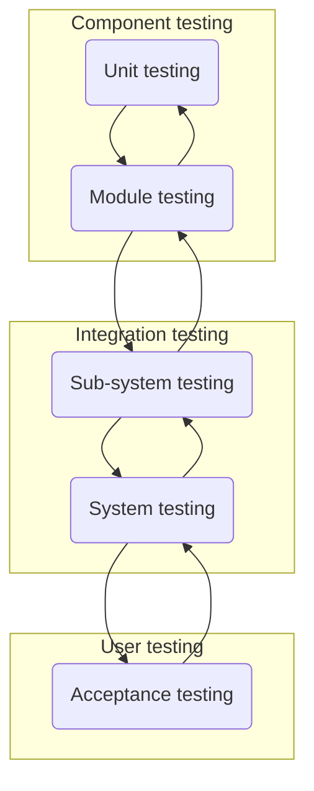

# Test-Driven Development
Il **costo manutentivo** predomina sul **costo di sviluppo**.
Nella realizzazione di software, 2 sono le categorie di costi:
1) *costi diretti*
   tipicamente il costo del personale, unico rimasto nella produzione; il costo degli strumenti e librerie esterne per l'aiuto allo sviluppo;
2) *costi indiretti*
   come costi amministrativi (del consulente legale), costi indipendenti dallo sviluppo del prodotto

Un sistema software, nel tempo, *evolve*.
Le *necessità*, nel tempo, anche loro cambiano.
Se il criterio di scelta è il risparmio, allora stiamo sbagliando: il costo visto e quello traslato verso il futuro, differiscono di molto; le attività di manutenzione possono cambiare:
- *manutenzione correttiva*, risolvente anomalie (in termine non preciso, bug)
  problemi tecnici del tipo, manca un test, vengono risolti; sarebbe meglio prevenire piuttosto che curare -> testing e uso corretto di compiler, profiler;
- *manutenzione adattativa*, il finanziamento completamente a carico del committente; tutte le volte che un sistema viene modificato, le anomalie devono essere risolte; l'adattabilità viene gestita in modo più semplice se presa in carico fin dall'inizio;
- *manutenzione perfettiva*, miglioramento richiesto dal committente; invece che 3 click su 3 bottoni diversi per fare la stessa cosa, ne mettiamo uno soltanto; il sistema perfezionato ci dà ritorni.

Una qualsiasi cosa che abbia a che fare con il progetto, chiamata *artefatto*, va presa in carico tenendo conto dei problemi che questa potrebbe avere.
Significa che una volta che è già in campo, l'artefatto ha costo complessivo maggiore rispetto a uno che non è stato implementato (dati anche i problemi che potrebbero sussistere).

## Testing
Fare testing non serve a dimostrare che il sistema è corretto, ma piuttosto per trovare i casi in cui fallimenti protrebbero avvenire.
- testing *in the small*, parti piccole singole, di facile automazione;
- testing *in the large*, per il sistema intero per esempio, complesso da automatizzare.



Tipi di testing da automatizzare:
1) Lo **unit testing** è previsto sulle pati più piccole del nostro sistema, come library oppure classi, nel caso nostro che usiamo JAVA`fas:Java`.
2) Il **module testing**, i package e sotto-package, come quello per fare gli aspetti `it.unipr.informatica.aspects`: cosa succede se le varie parti del sistema vengono messe in relazione tra loro? Funzionano?
3) Il **sub-system testing**, dove un sottosistema è uno per fatti suoi ma che non è quello definitivo, con caratteristiche e funzionante ma che da solo non risulta a tanto.
4) Il **system testing**, del sistema completo, delle interfacce utente. Ciò che il committente ci ha commissionato. 
5) L'**acceptance testing** che di per se non sarebbe un testing ma piuttosto una validazione del sistema, per capire se questo fa quello che dovrebbe.

### In the small
Uno sviluppatore non dovrebbe fare commit su GitHub`fas:Github` se i test non vengono passati. Per fare testing in the small abbiamo:
- *statement testing*, test di copertura topologico
  almeno una volta tutti gli statement devono essere eseguiti, non sufficiente uno soltanto ma almeno una volta questo va fatto;
- *path coverage testing*
  ogni branch di codice deve essere testata, se l'unica cosa che deve fare il branch è chiamare un metodo, allora questa è già stata coperta; 1 su 2 branch restituisce booleano positivo;
- *condition coverage testing*
  ci servono entrambe le branch che stiamo testando, positive in testing; le condizioni booleane devono essere verificate tutte.

#### JUnit
Che mette a disposizione:
- *test cases*, metodi per fare testing dei motodi di una classe;
- *test suites*, blocchi di test case che devono essere assieme verificati.

Quali test fare e dove metterli, è tutto a carico nostro.
Corner case possono essere lasciati momentaneamente da parte, mentre il caso di problemi imponenti che proprio non fanno funzionare il software, devono essere evitati nel push sulla repository.

## Example17
Usiamo l'esempio dei books visto in precedenza.
Per fare testing, useremo soltanto `SimpleBook.java` e per farlo creiamo un altro progetto.
Quando lo costruiamo, diamo alla nostra unit test lo stesso nome dell'unità che vogliamo testare, terminando con 'Tests', e cliccando sul package creiamo un nuovo 'JUnit Test Case'.

![[Pasted image 20221215090807.png|650]]

Alla nuova finestra che si aprirà, non è necessario inserire nulla se non il nome della classe con i test. Il resto delle opzioni possono essere codificate direttamente scrivendolo in codice.

![[Pasted image 20221215091301.png|350]]

Alla domanda se vogliamo o meno aggiungere 'JUnit5' al nostro class path, risponderemo 'Yes'. Garantiamo di fare almeno 1 statement test, copertura di tutti gli statement.
Per ogni caso di test, andremo ad annotare il metodo con l'annotazione `@Test`.
La classe `SimpleBookTest.java` conterrà soltanto i metodi test.

Come prima cosa, facciamo un caso che verifichi che la classe `SimpleBook` implementante `Book`, sia effettivamente un `Clonable` e `Serializable`, come richiesto nell'obbiettivo dell'esercizio visto.
La parola `assertTrue()` serve per scrivere che cosa deve essere vero, in questo caso, sarà falsa se `book` non è istanza di `Clonable`.
```java
public class SimpleBookTest {
	@Test
	public void classImplementsCloneable() {
		Book book = new SimpleBook(1, "Author", "Title");
		assertTrue(book instanceof Cloneable);
	}

	@Test
	public void classImplementsSerializable() {
		Book book = new SimpleBook(1, "Author", "Title");
		assertTrue(book instanceof Serializable);
	}
	//...
```

In altri casi, ci dovremmo aspettare un'eccezione.
```java
	//...
	@Test(expected = IllegalArgumentException.class)
	public void constructorIdLessThanOne() {
		new SimpleBook(0, "Author", "Title");
	}
	//...
```

Altre volte, ci serve verificare l'uguaglianza tra dati.
```java
	//...
	@Test
	public void getIDOK() {
		Book book = new SimpleBook(1, "Author", "Title");
		assertEquals(1, book.getID());
	}

	@Test
	public void setIDOK() {
		SimpleBook book = new SimpleBook(1, "Author", "Title");
		book.setID(2);
		assertEquals(2, book.getID());
	}
	//...
```

Per eseguire i test, uno dopo l'altro, contenuti nella nostra test suite, eseguiamo la classe come una 'JUnit Test'. L'operazione va fatta prima di commit.
Se siamo convinti della copertura e non c'è nessun errore o fallimento, possiamo fare commit sulla repository.

![[Pasted image 20221215093209.png|400]]

![[Pasted image 20221215093406.png|350]]