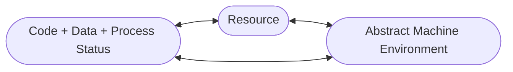
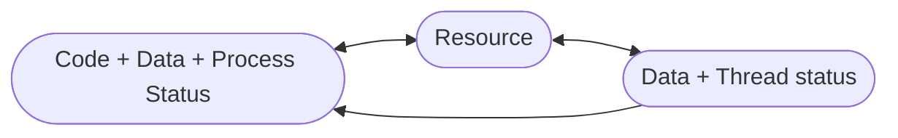

# Sistemi concorrenti
#java #processo #thread #mutex 
Ogni esecutore, sta eseguendo un *programma concorrente*. 
Nei casi reali, con condivisione di qualcosa, o i risultati dipendenti dalle computazioni, allora stiamo eseguendo un unico programma concorrente. I *vincoli di sequenzializzazione* sono utili per garantire maggiore qualità all'esecuzione, siccome il SO lavora insieme al nostro programma.

I **linguaggi concorrenti** permettono di definire questi vincoli.
Alcuni linguaggi ne sono particolarmente ricchi.

## JAVA
![[Pasted image 20221006110933.png|100]]
Linguaggio di programmazione concorrente, risolvente tutti i problemi comparsi con i vincoli di concorrenza. 
I <u>sistemi paralleli</u> sono impiegati su una set di CPU per eseguire diversi processi e i loro thread paralleli allo stesso tempo.
I <u>sistemi concorrenti</u> sono impiegati su singola CPU ma sono strotturati come fossero sistemi paralleli:
- a volte parti del sistema concorrente sono in verità sistemi paralleli
- pezzi di codice possono essere allocati indipendentemente.

### Processo
Un *processo* è un'esecuzione dinamica di un *programma*, che può essere eseguito. Le risorse da fornire al processo sono fondamentali per la sopravvivenza dello stesso (riciclo di risorsa a tempo costante). Al processo forniamo anche uno stato.

In Java, un processo esegue la *macchina astratta (o virtuale)*, che ha un suo set d'istruzioni, un suo modo di rappresentare i dati in modo virtualizzato, slegandoci così dalle proprietà delle macchine.
La **Java Virtual Machine (JVM)** fornisce le astrazioni allo stesso modo per i processi.


### Thread
Flussi di esecuzione.
- sempre e comunque associati a un singolo processo;
- diversi thread associabili a singolo processo;
- i thread possono essere dinamicamente avviati o terminati;
- allocano risorse per la loro esecuzione, chiedendo al processo;
- alcuni dati, non tutti, possono essere privati (propria del thread);
- la memoria condivisa è visibile a tutti i thread del processo.



Ci sono 2 modi per descrivere i thread in Java.
Usiamo il paradigma ad oggetti tipico, permettendoci di manipolare i thread facendo chiamate all'oggetto.
- estendendo `java.lang.Thread`, classe principale del linguaggio che non abbiamo bisogno d'importare all'inizio del nostro programma
  ```java
  public class MyThread extends Thread {
	  @Override
	  public void run() {
		  // corpo del thread
	  }
  }
  ```
  L'unico modo per fare terminare il thread è *farlo uscire* dalla funzione `run()`, che scriveremo all'interno del suo corpo. Per farlo partire usiamo `start()` e rimarrà attivo finchè non termina i suoi compiti.

- implementando l'interfaccia `java.lang.Runnable`, che è vuoto e dobbiamo ridefinirlo
	```java
	public class MyRunnable implements Runnable {
		@Override
		public void run() {
			// corpo del thread
		}
	}
	```

In tutti e 2 i modi, il metodo `run()` contiene sezioni del programma che il thread esegue. `start()` viene usata per eseguire la `run()`.

![[Pasted image 20221006115930.png|600]]

#### FUNZIONI
- `sleep(millis)` con attesa temporizzata che forza il thread ad essere bloccato per un certo quantitativo di tempo
- `join()` forza il thread ad'essere bloccato e aspetta che colui che l'ha invocato termini
- `interrupt()` non fa uscire dalla sezione critica, la `wait()` viene sbloccata e inviata una eccezione
- ...

## JAVA Memory Model
Parliamo di JAVA Memory Model perché siamo interessati allo stack: i frame dello stack che identificano le singole chiamate sono isolati.
I thread di un programma Java quindi:
- hanno stack privato per singole chiamate;
- hanno *private thread-local storage*;
- condividono heap dell'oggetto.

Nel JAVA Memory Model gli oggetti risiedono nell'heap, nei thread stack ci sono le chiamate delle funzioni.

La memoria dell'elaboratore (CPU) è elemento di elaborazioni con registri ad accesso immediato (registers), memoria (cache), connesso a RAM. Il problema delle cache sussiste perché nessuno ci assicura che nella cache, che è condivisa, il processo rimanghi integro (dati replicati). Non ci interessa troppo, però non vogliamo fornire cache alla JVM.

L'esecuzione del thread su CPU multiple causa rilevanti *problemi di coerenza mnemonici*. Possiamo risolvere se l'accesso alla memoria condivisa è controllato, con però l'inevitabile inefficienza di parallelismo e risorse.

### Mutua esclusione

![[Pasted image 20221011095354.png|500]]

Il problema della ==mutua esclusione== sussiste se dato un insieme di sezioni che vogliamo essere mutualmente esclusive, quando un thread entra in una di esse, nessun altro vi può entrare sena un 'pass'.
Tutti i thread che provano a eseguire, sono in attesa.
Una volta completata la computazione, il thread esce dalla sezione critica e gli altri possono entrarvi.

Una sezione di codice $M=\{P_1, P_2, \dots , P_N\}$ viene definita per la sezione critica: per esempio, se le sezioni blu sono le sezioni critiche, all'ora all'interno di esse dovrà esserci un solo thread.

Per risolvere il problema usiamo dispositivi a tempo di esecuzione chiamati **mutex** (MUTual EXclusion device), ogni tipologia di mutex ha caratteristiche diverse ma JAVA ce ne fornisce uno e questo viene chiamato **sezione critica**: una porzione di codice che deve garantire mutua esclusione su tutte le parti di codice preferite, in senso astratto possiamo pensarlo come un colore (mutua esclusione tra le sezioni di codice con lo stesso colore).

In JAVA il mutex è un oggetto, se un thread vuole entrare in sezione critica controlla che non ci sia già qualcuno e se è tutto libero, allora vi entra. Acquisizione e rilascio sono:
- rientranti;
- sincroni.

![[Pasted image 20221011092125.png|500]]

Nel momento in cui si entra in una sezione condivisa, i dati condivisi vengono bloccati, una volta usciti i dati condivisi assumono il valore aggiornato in tutte le cache. Tutti gli accessi ai dati condivisi devono essere in sezione critica, ma possiamo accedere alla memoria condivisa con parsimonia evitando problemi (aumentando la parallelizzazione). 

Il metodo *esplicito* per dichiarare che una sequenza di codice è critica, è metterlo dentro un blocco con la parola chiave `synchronized`.
```java
public void myMethod(Object o) {
	synchronized(o) {
		//critical section
	}
}
```

Per definire una sezione critica su metodo invece usiamo il modo *implicito* e va benissimo nel caso il metodo sia privato.
```java
public synchronized void myMethod() {
	//critical section
}
```

L'utilizzo di sezioni critiche appesantisce inutilmente il carico sul sistema e sul SO, bisogna usarle con cautela.

#### HAPPENS-BEFORE
JAVA definisce relazione *happens-before* su operazioni mnemoniche come letture e scritture di varibili condivise. Soltanto se la *write* <u>avviene prima</u> della *read* allora il nostro thread sarà garantito nel vedere le modifiche apportate da un altro.

- uno sblocco/rilascio del mutex *happens-before* lo stesso mutex venghi bloccato/acquisito (le lock vengono messe in coda)
- la scrittura a un campo `volatile` *happens-before* di una susseguente lettura sullo stesso campo
	- non garantisce la mutua esclusione
- una chiamata a `start()` su un thread *happens-before* qualsiasi azione sul thread avviato
- prima della `join()` tutte le operazioni sono state completate

Tutte le modifiche all'oggetto vengono propagate, siccome l'oggetto ha come parola chiave `synchronized` (i campi `final` siccome non possono essere modificati dopo compilazione, allora non ce ne preoccupiamo).

### Waiting and Notifying Events
Un thread in attesa di eventi, senza che esista un check dello stesso per il controllo di tali eventi, sarà in *busy waiting*, non utilizzerà gli strumenti di programmazione concorrenti che JAVA ha. Noi non lo vogliamo:

Nella <u>sezione critica</u>:
- i metodi `notify()` e `notifyAll()` possono essere utilizzati all'interno del thread per *notificare a oggetto* `obj`, che un qualche evento è successo. Nel caso di `notifyAll()` vengono risvegliati tutti i thread che erano in attesa (uno solo vi entrerà). Per `notify()` viene risvegliato l'unico thread che cercava di entrare in sezione ciritica. Vengono fornite due funzioni di questo tipo, siccome non vogliamo risvegliare sempre tutti i thread.
- un thread che necessita di aspettare per eventi usa `wait()` in sezione critica e funziona sullo stesso oggetto `obj` usato per notificare eventi.
- la `wait(millis)` può essere usata per aspettare non più di tot millisecondi, useremo molto spesso la `wait()` senza argomenti; ogni variante lancia l'eccezione `InterruptedException` se qualche thread interrompe il thread in esecuzione prima o mentre il thread corrente aspettava un evento


---
2022-10-13