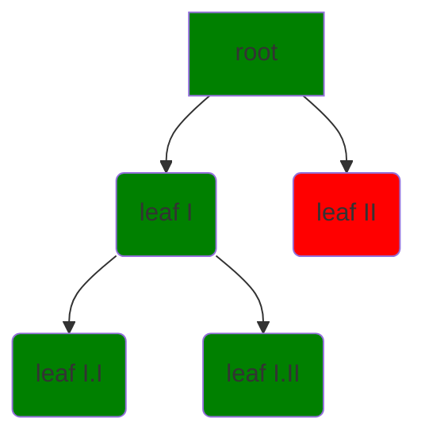

# I sistemi concorrenti
#linguaggio-formale #linguaggio-logico #logica #interpretazione #tautologia #contraddizione #de-morgan #contrapposizione #tableaux

Lo studio dei sistemi concorrenti dal punto di vista matematico facilita lo studio dello stesso. Errori possono essere evitati, race condition, dead lock, ecc. Bisogna capire durante la computazione, usando la *logica*.

$$(p \vee q) \wedge (\neg p \vee \neg q)$$

Un **linguaggio formale** è formato da:
- sintassi, set di formule ben definite
- semantica, interpretazione della sintassi

Un **linguaggio logico** è un linguaggio formale formato:
- *assiomi*, deduzioni logiche, ovvero verità presunte
- *regole d'inferenza*, per ottenere nuove verità dagli assiomi

Applicare un algoritmo/teorema lo si fa partendo da assiomi e regole. Purtroppo il linguaggio minimo per descrivere la matematica fa sì che per come è fatto (aritmetica dei numeri interi), non ci sono sempre dimostrazioni per il teorema.

---
# Logica proposizionale
La **logica proposizionale** è formata da simboli: questi simboli sono *atomi* e sono letti come se fossero affermazioni *TRUE* o *FALSE*. Avere la logica ci permette di descrivere la correttezza, ma nel corso vedremo di più il suo uso per la concorrenza.

Un *simbolo proposizionale* è una costante inserita all'interno della nostra formula. 

$q$ = Alice odia Bob...

Usiamo *connettivi* per costruire formule.
Questi hanno associatività a sinistra e precedenza diversa, in ordine:

$$\neg, \wedge, \vee, \to, \equiv$$
- $\neg$ la negazione, *NOT*, il cambiamento di segno
- $\wedge$ la congiunzione, *AND*, come fosse il prodotto
- $\vee$ la disgiunzione, *OR*, come fosse una somma
- $\to$ "se *a* allora *b*"
- $\equiv$ "se e soltanto se"

L'insieme dei simboli proposizionali è chiamato $P$.
$\top$ (top), $\bot$ (bottom) non sono appartenenti a $P$, hanno valori costanti e sono rispettivamente *TRUE* e *FALSE* (potremmo anche ometterli).
Le parentesi tonde più esterne possiamo ometterle o meno, possiamo usare quadre e graffe ma non sono necessarie.

$$p \wedge q \wedge r \to ((p \wedge q)\wedge r)$$

Se qualcuno fornisce un insieme non vuoto, riusciamo a creare formule ben formate. Abbiamo così la sintassi, ci serve ora la semantica. La logica delle proposizioni serve ad attribuire un *significato* che è un *valore di verità*. 
Una interpretazione è una funzione che assegna un valore di verità a ciascun e ogni simbolo di $P$.

`esempio di interpretazione P`

|     | p   | q   | r   |
| --- | --- | --- | --- |
| I1  | F   | F   | F   |
| I2  | F   | F   | T   |
| I3  | F   | T   | F   |
| I4  | T   | F   | F   |
| ... | ... | ... | ...    |
*Cosa succede se $P$ è infinito*?
Il numero d'interpretazioni possibili diventerebbe $2^\infty$, con 2 gli stati possibili *TRUE* e *FALSE*.

## Interpretazione
Data un'***interpretazione*** $I$ su $P$, che chiamiamo $G_I$, ha le stesse proprietà di $P$, la funzione porta agli stessi risultati.

$$G_I(A) = I(A) \to P(A) = I(A)$$

![[Pasted image 20220922181002.png|600]]

## Modello
Una interpretazione $I$ è un ***modello*** per la proposizione $A$ se e soltanto se$$I \models A$$
con $I$ tale che $I(p)=F$ e $I(q)=T$, allora $I$ è un modello per $A$.
`esempio`: $A = (p \to q)\wedge q$

![[Pasted image 20220922181214.png|600]]

Per verificare quello che abbiamo detto fino adesso (*model checking algorithm*):
$$I\models p$$ 
se e soltanto se $I(p)=T$ e $p\in P$

## Tautologia
Se un'interpretazione è sempre vera allora questa si chiama **tautologia**, con valore semantico sempre vero. Ci serve per fare ragionamenti. Ci è molto comodo siccome siamo indipendenti dalle interpretazioni dimenticandoci i valori semantici.

`esempio:` $p \to (p \vee q)$ è una tautologia

| $A \to A$              | sempre vera |
| ---------------------- | ----------- |
| $\neg A \to (A \to B)$ | sempre vera |
| $\bot \to B$           | sempre vera |
| $A \vee \neg A$        | sempre vera |
| ...                    | ...         | 

## Contraddizione
Si dice **contraddizione** invece, soltanto se le interpretazioni sono modelli di proposizione $A$.

## Equivalenza logica
Proposizioni $A$ e $B$ sono **logicamente equivalenti** ($A \leftrightarrow B$) se e soltanto se $\models (A \equiv B)$: stiamo parlando di equivalenze guardando le tautologie.
- **Legge doppia negazione**
$A \leftrightarrow \neg \neg A$
- **Legge di De Morgan**
$\neg (A \vee B) \leftrightarrow (\neg A \wedge \neg B)$
$\neg (A \wedge B) \leftrightarrow (\neg A \vee \neg B)$
- **Legge di contrapposizione**
$(A \to B) \leftrightarrow (\neg B \to \neg A)$

## Conseguenza logica
La proposizione $A$ è una **conseguenza logica** di set di proposizioni $S (S \models A)$ se e soltanto se ogni $I$ per $S$ è anche modello per $A$.

`esempio:` $\{p \vee q, p \to r, q \to r\} \models r$
-> è vera $p$ oppure $q$, quindi se è vera $p$ allora è vera $r$, stessa cosa per $q$

Per controllare la veridicità della conseguenza, possiamo usare diversi metodi:
- scrivere la *tabella di verità* di $\{A_1 \wedge A_2 \wedge \dots \wedge A_n \} \to B$
- usare un set di *sound and complete inference rules* (insieme di regole di scrittura che ci permettono di raggiungere conseguenze logiche nuove da quelle da cui siamo partiti)
- usare il *metodo tableau semantico*, metodo algoritmico su carta

### Forma negazione della proposizione
- solo *congiunzioni*, *disgiunzioni* e *negazioni* sono usate nella proposizione
- le negazioni occorrono solo nei letterari (niente formule complesse)

## ==Tableaux proposizionale==
è un *albero* in cui ogni nodo viene etichettato con un insieme di proposizioni, per costruire i figli di ogni nodo:
- un set iniziale di proposizioni in forma negata, indica la radice
- $X \cup \{A \wedge B \}$ diventa un figlio $A \cup \{A, B\}$
- $X \cup \{A \vee B \}$ diventa due figli $X \cup \{A\}$ e $X \cup \{B\}$
- $X \cup \{P, \neg P\}$ marchiamo la foglia come *contraddittoria*

partiamo da 1 o 2 proposizioni, le mettiamo insieme e generiamo un albero, il che significa semplificare la formula

Questo tableau viene utilizzato per controllare la soddisfacibiltà:
- il percorso che collega radice a foglia si dice *chiuso* se la foglia è marcata come contraddittoria altrimenti è aperta
- tableau è *chiuso* se tutti i passi lo sono
- se tutti i nodi finiscono in contraddizioni allora il tableau è chiuso
- un nodo aperto marca la radice

avremo percorsi ciclici ma se siamo bravi a gestirli allora riusciremo a completare il tableau, perché non ci interessa espanderle

![[Pasted image 20220922121000.png|700]]
>abbiamo il caso in cui i risultati del tableau danno **DEADLOCK**

![[Pasted image 20220922121043.png|700]]
> il nodo è aperto, siamo felici

---
up to: lezione 3 22-09
last revision: 22-09 19:35