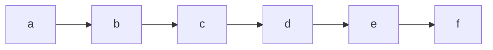
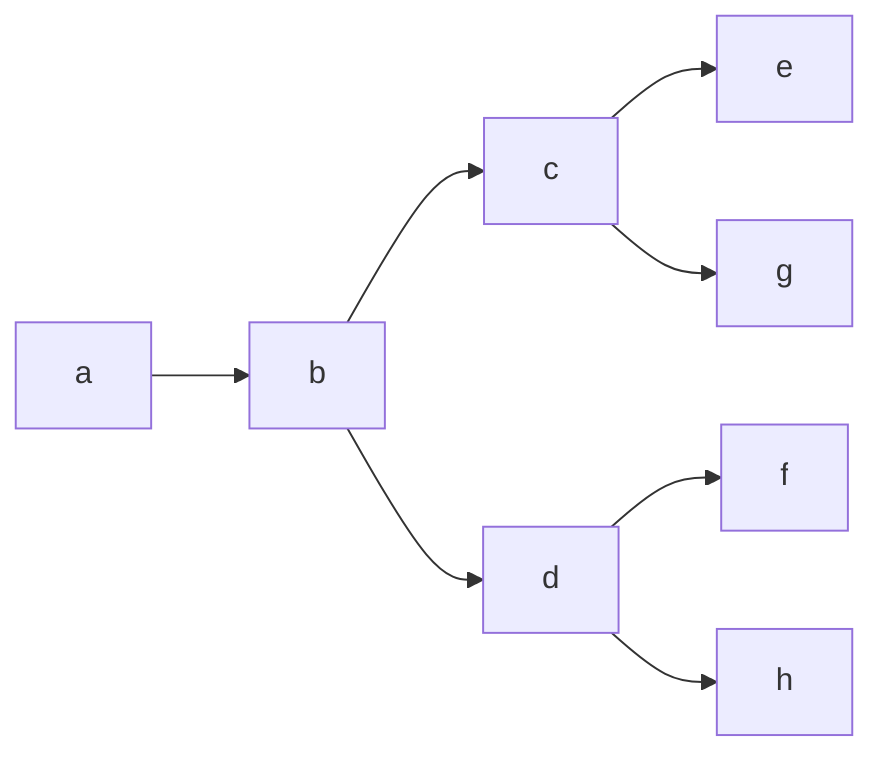

# Logica temporale
#logica-temporale #ltl #ctl

Se immaginiamo un'affermazione di un sistema software che cambi nel tempo, vuole dire che la sua interpretazione cambia nel tempo.
Nella logica classica a ogni proposizione viene assegnata una *singola* verità statica, nella logica **temporale** consideriamo invece i **mondi**.

Nel mondo di oggi = ✅ TRUE
Nel mondo di domani = ❌ FALSE

Nell'istante di tempo che noi stiamo considerando, avremo un cambiamento dello stato. Dato un mondo avremo un *insieme* di mondi possibili.

## Logica temporale lineare (LTL)

Un *unico* mondo futuro possibile nella **Linear Temporal Logic**.
La logica temporale lineare è la più semplice, andando a mettere all'interno della logica degli **operatori modali**:

| LTL operators |                                                            |
| ------------- | ---------------------------------------------------------- |
| $X_p$         | $p$ è *vera* nel *prossimo istante* temporale                  |
| $G_p$         | $p$ è *globalmente vero* in *tutti i momenti futuri* possibili |
| $F_p$         | $p$ è *vera* in *qualche momento nel futuro*                   |
| $p U q$    | $p$ è *vera* finché $q$ è *vera*                               |

> [!example] Esempio di LTL
$G((\neg p \vee \neg t) \to X \neg b)$
> - $p$ è avere un passaporto
> - $t$ è passare il gate
> - $b$ essere in imbarco

La descrizione astratta del nostro sistema software:
- $G (requested \to Freceived)$
- $G(received \to Xprocessed)$
- $G(processed \to FGdone)$

### Sintassi
La precedenza delle operazioni sintattiche:
$$\neg, G, F, X, U, \wedge, \vee, \to, \equiv$$
### Semantica
Nella semantica costruiamo una funzione:
$$I : P * \mathbb{N} \to B$$
dove $I$ sarebbe un indice numerante i *mondi possibili*, attribuendo un numero a ogni mondo come se fossimo su una linea temporale; mentre 
$B = \{F, T\}$ mappa ogni simbolo proposizionale a $B$ per ogni istante nel tempo. 

### Tableau temporale - loop rule
La **regola di loop** serve per applicare da un tableau in formule negate:
- se abbiamo una foglia etichettata con letterali LTL e proposizioni strutturate come $XP$ per qualche $P$ allora:
	- prendiamo tutti gli argomenti di $X$ e controlliamo che esista un nodo contenente questi argomenti, che significa tornare indietro in un loop e quindi terminiamo
	- se non è così allora connettiamo una foglia il cui label sarà superset di $S'$
- possiamo così garantire di non espandere in rami infiniti

I simboli del tableau possiamo così rappresentarli:
- $\Box$ per *globally*
- $\circ$ per *next*
- $\diamond$ per *future*

![[Pasted image 20220927102337.png|700]]

## (CTL)

