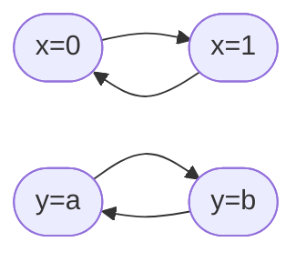

```toc
```
# Logica temporale
Se immaginiamo un'affermazione di un sistema software che cambi nel tempo, vuole dire che la sua interpretazione cambia nel tempo.
Nella logica classica a ogni proposizione viene assegnata una *singola* verità statica, nella logica **temporale** consideriamo invece i **mondi**.

Nel mondo di oggi = <mark style="background: #BBFABBA6;">`fas:Check` TRUE</mark>
Nel mondo di domani = <mark style="background: #FF5582A6;">`fas:Times` FALSE</mark>

Nell'istante di tempo che noi stiamo considerando, avremo un cambiamento dello stato. Dato un mondo avremo un *insieme* di mondi possibili.

Normalmente le proprietà dei sistemi software sono studiate usando logiche temporali e sono raggruppate in 3 categorie:
- <u>safety</u>, per garantire che il sistema viva sempre a tempo indefinito, senza problemi di alcun tipo (esempio negativo: bug)
  > [!example]
  > $G \neg (\mathtt{temperature} > 100)$
  > La temperatura rimane sopra i 100 gradi
- <u>liveness</u>, se c'è un processo, esso avrà modo di fare qualcosa (esempio negativo: deadlock)
  > [!example]
  > $G(\mathtt{started} \to F\mathtt{terminated})$
  > Prima o poi, dopo essere partito, il processo terminerà
- (strong) <u>fairness</u>, se qualcosa viene richiesto infinite volte, allora verrà fatto infinite volte (esempio negativo: starving)
  > [!example]
  > $GF\mathtt{ready} \to GF\mathtt{execute}$
  > Prima o poi la computazione che sta richiedendo, verrà fatta

![[Pasted image 20221004095317.png|]]

## Logica temporale lineare (LTL)

Un *unico* mondo futuro possibile nella **Linear Temporal Logic**.
La logica temporale lineare è la più semplice, andando a mettere all'interno della logica degli **operatori modali**:

| LTL operators |                                                            |
| ------------- | ---------------------------------------------------------- |
| $X_p$         | $p$ è *vera* nel *prossimo istante* temporale                  |
| $G_p$         | $p$ è *globalmente vero* in *tutti i momenti futuri* possibili |
| $F_p$         | $p$ è *vera* in *qualche momento nel futuro*                   |
| $p U q$    | $p$ è *vera* finché $q$ *non è vera*                               |

> [!example] Esempio di LTL
$G((\neg p \vee \neg t) \to X \neg b)$
> - $p$ è avere un passaporto
> - $t$ è passare il gate
> - $b$ essere in imbarco


La descrizione astratta del nostro sistema software:
- $G (\mathtt{requested} \to F\mathtt{received})$
- $G(\mathtt{received} \to X\mathtt{processed})$
- $G(\mathtt{processed} \to FG\mathtt{done})$

### Sintassi
La precedenza delle operazioni sintattiche:
$$\neg, G, F, X, U, \wedge, \vee, \to, \equiv$$
### Semantica
Nella semantica costruiamo una funzione:
$$I : P * \mathbb{N} \to B$$
dove $I$ sarebbe un indice numerante i *mondi possibili*, attribuendo un numero a ogni mondo come se fossimo su una linea temporale; mentre 
$B = \{F, T\}$ mappa ogni simbolo proposizionale a $B$ per ogni istante nel tempo. 

![[Pasted image 20220927200953.png|600]]

### Tableau temporale (espansione)
L'espansione del tableau, uguale al caso proposizionale, cosi' segue:
- $S \cup \{P, \neg P\}$ ci fermiamo con l'espansione;
- $S \cup \{A \wedge B\}$ aggiungiamo nodo figlio $S \cup \{A, B\}$;
- $S \cup \{A \vee B\}$ aggiungiamo 2 nodi figli $S \cup \{A\}$ e $S \cup\{B\}$.

All'espansione poi sopraggiungono gli operatori temporali:
- $S \cup \{GA\}$ aggiungiamo nodo figlio $S \cup \{A, XGA\}$;
- $S \cup \{FA\}$ aggiungiamo 2 nodi figli $S \cup \{A\}$ e $S \cup \{XFA\}$;
- $S \cup \{AUB\}$ aggiungiamo 2 nodi figli $S \cup \{B\}$ e $S \cup \{A, X(AUB)\}$.

#### Loop rule
La **regola di loop** serve per applicare da un tableau in formule negate:
- se abbiamo una foglia etichettata con letterali LTL e proposizioni strutturate come $XP$ per qualche $P$ allora:
	- prendiamo tutti gli argomenti di $X$ e controlliamo che esista un nodo contenente questi argomenti, che significa tornare indietro in un loop e quindi terminiamo
	- se non è così allora connettiamo una foglia il cui label sarà superset di $S'$
- possiamo così garantire di non espandere in rami infiniti

I simboli del tableau così rappresentati:
- $\Box$ per *globally*
- $\circ$ per *next*
- $\diamond$ per *future*

![[Pasted image 20220927102337.png|700]]


## Computational tree logic (CTL)

Limiti di LTL vengono presi in carico dalla CTL, la logica si *biforca*.
Le *proprietà dei percorsi* vengono prese piuttosto che gli stati dei nodi e per farlo introduciamo nuovi op. modali e op. temporali:
- operatori esistenziali
- operatori universali

Le scelte non deterministiche vengono espanse in modo infinito, gli stati già espansi non vengono ripresi in considerazione.


## Computational tree logic\* (CTL*)
Permette due tipi di proposizioni:
- stati proposizionali
- percorsi proposizionali

## Sistema concorrente reattivo asincrono
Un *sistema* che è in attesa di eventi, interagisce con l'ambiente e non dovrebbe terminare. Parliamo di un sistema *concorrente asincrono (agente)*, sistema di quelli di cui facciamo riferimento perché quelli oggi usati. Possiamo dire che, in un istante di tempo 1 solo thread è in esecuione, quando in verità possono essere molteplici.

> [!example]
interfacce grafiche moderne, GUI

Sistemi sincroni con singolo blocco e multi-funzionale, clock comune, esistono ancora (MIMD). La rilevanza è abbastanza limitata, non ci interessa per fare parti grafiche per esempio.

### Modelling
Serve per *specificare un sistema astratto*:
- formato da **stati**;
- formato da **transizioni**;
- considerando la **computazione**.

Non ci interessa il risultato, ma cosa avviene attraversando gli stati, garantiamo l'attraversamento corretto.

#### KRIPKE STRUCTURES
Le **strutture di Kripke** sono diagrammi di transizione che descrivono il comportamento del nostro sistema reattivo e sono proprio queste che ci servono per la modellazione. La stessa operazione l'abbiamo fatta per i tableau.

Formalmente, sono una 5-upla $K=<S,I,R,P,L>$ dove:
- $S$ è un set non vuoto di stati;
- $I \subseteq C$ set di stati iniziali;
- $R \subseteq S*S$ è una *relazione di accessibilità*, set di transizioni per fare sì che $R$ sia left-total;
- $P$ set di simboli proposizionali per costruire $Prop[P]$;
- $L:S \to 2^{Prop[P]}$ funzione di labeling
Un *passo* $\pi$ è una sequenza infinita di stati:
$$\pi = s_0 s_1 s_2 \cdots$$

L'insieme di stati non è finito.

In composizione asincrona:


Un esempio di computazione sequenziale, prendendo parti di memoria che consideriamo critica (C) e non critica (NC):
