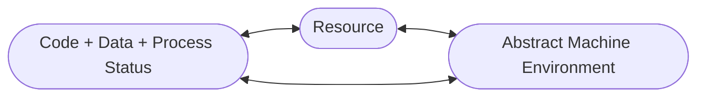
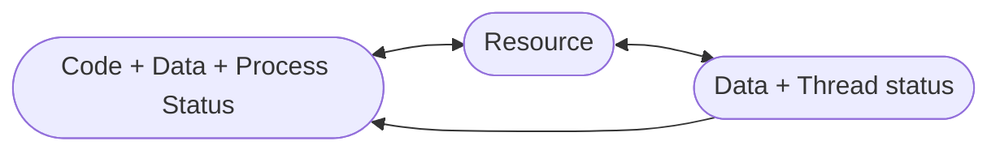

# Sistemi concorrenti
#java #processo #thread
Ogni esecutore, sta eseguendo un *programma concorrente*. 
Nei casi reali, con condivisione di qualcosa, o i risultati dipendenti dalle computazioni, allora stiamo eseguendo un unico programma concorrente. I *vincoli di sequenzializzazione* sono utili per garantire maggiore qualità all'esecuzione, siccome il SO lavora insieme al nostro programma.

I **linguaggi concorrenti** permettono di definire questi vincoli.
Alcuni linguaggi ne sono particolarmente ricchi.

## JAVA
![[Pasted image 20221006110933.png|100]]
Linguaggio di programmazione concorrente, risolvente tutti i problemi comparsi con i vincoli di concorrenza. 
I <u>sistemi paralleli</u> sono impiegati su una set di CPU per eseguire diversi processi e i loro thread paralleli allo stesso tempo.
I <u>sistemi concorrenti</u> sono impiegati su singola CPU ma sono strotturati come fossero sistemi paralleli:
- a volte parti del sistema concorrente sono in verità sistemi paralleli
- pezzi di codice possono essere allocati indipendentemente.

### Processo
Un *processo* è un'esecuzione dinamica di un *programma*, che può essere eseguito. Le risorse da fornire al processo sono fondamentali per la sopravvivenza dello stesso (riciclo di risorsa a tempo costante). Al processo forniamo anche uno stato.

In Java, un processo esegue la *macchina astratta (o virtuale)*, che ha un suo set d'istruzioni, un suo modo di rappresentare i dati in modo virtualizzato, slegandoci così dalle proprietà delle macchine.
La **Java Virtual Machine (JVM)** fornisce le astrazioni allo stesso modo per i processi.


### Thread
Flussi di esecuzione.
- sempre e comunque associati a un singolo processo;
- diversi thread associabili a singolo processo;
- i thread possono essere dinamicamente avviati o terminati;
- allocano risorse per la loro esecuzione, chiedendo al processo;
- alcuni dati, non tutti, possono essere privati (propria del thread);
- la memoria condivisa è visibile a tutti i thread del processo.



Ci sono 2 modi per descrivere i thread in Java.
Usiamo il paradigma ad oggetti tipico, permettendoci di manipolare i thread facendo chiamate all'oggetto.
- estendendo `java.lang.Thread`, classe principale del linguaggio che non abbiamo bisogno d'importare all'inizio del nostro programma
  ```java
  public class MyThread extends Thread {
	  @Override
	  public void run() {
		  // corpo del thread
	  }
  }
  ```
  L'unico modo per fare terminare il thread è *farlo uscire* dalla funzione `run()`, che scriveremo all'interno del suo corpo. Per farlo partire usiamo `start()` e rimarrà attivo finchè non termina i suoi compiti.

- implementando l'interfaccia `java.lang.Runnable`, che è vuoto e dobbiamo ridefinirlo
	```java
	public class MyRunnable implements Runnable {
		@Override
		public void run() {
			// corpo del thread
		}
	}
	```

In tutti e 2 i modi, il metodo `run()` contiene sezioni del programma che il thread esegue. `start()` viene usata per eseguire la `run()`.

![[Pasted image 20221006115930.png|600]]

#### FUNZIONI
- `sleep(millis)` con attesa temporizzata che forza il thread ad essere bloccato per un certo quantitativo di tempo
- `join()` forza il thread ad'essere bloccato e aspetta che colui che l'ha invocato termini
- ...

## JAVA Memory Model
